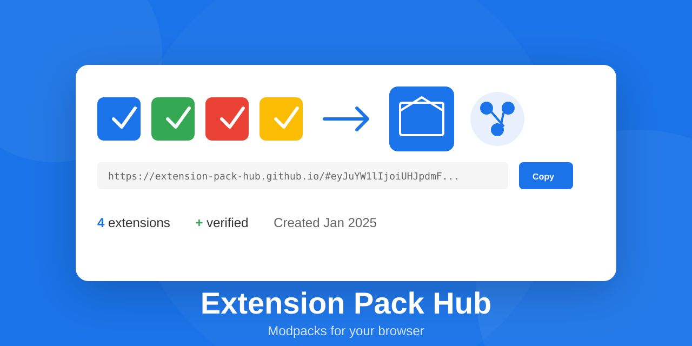

<p align="center">
  
</p>

# 📦 Extension Pack Hub

**Create, share, and install browser extension packs — like modpacks for Minecraft, but for Chrome.**

Bundle your favorite extensions together and share them with a single URL. No accounts, no backend, just a link.

## ✨ Features

| Feature | Description |
|---------|-------------|
| 🎯 **Create Packs** | Select from your installed extensions and bundle them |
| 🔗 **Share Easily** | Everything encoded in the URL — no accounts needed |
| 📥 **Guided Install** | Step-by-step wizard for installing extensions |
| 🔒 **Stay Safe** | Store extensions verified by Chrome, GitHub extensions show permission warnings |
| 🌐 **Works Everywhere** | Static website + companion extension |

## 🚀 Quick Start

### Install the Extension

1. Clone this repo
2. Open Chrome → `chrome://extensions`
3. Enable **Developer mode**
4. Click **Load unpacked** → select the `extension/` folder

### Create Your First Pack

1. Click the Extension Pack Hub icon
2. Select extensions you want to include
3. Add a name and description
4. Click **Create Pack** → copy the URL
5. Share it anywhere!

## 📦 Pack Format

Packs are encoded directly in the URL hash:

```
https://ifaka.github.io/extension-pack-hub/#eyJuYW1lIjoiUHJpdmFjeSBQYWNrIi4uLn0
```

### Manifest Schema

```json
{
  "v": 2,
  "name": "Privacy Essentials",
  "description": "My favorite privacy extensions",
  "author": "username",
  "extensions": [
    {
      "type": "store",
      "id": "cjpalhdlnbpafiamejdnhcphjbkeiagm",
      "name": "uBlock Origin"
    },
    {
      "type": "github",
      "repo": "user/my-extension",
      "name": "Custom Tool",
      "releaseTag": "v1.0.0"
    }
  ],
  "created": "2025-01-15"
}
```

## 🔧 Extension Types

| Type | Source | Install Method |
|------|--------|----------------|
| `store` | Chrome Web Store | One-click install |
| `github` | GitHub Releases | Download + Load unpacked |

### Store Extensions
- Verified by Google's review process
- Links directly to Chrome Web Store
- Easiest for end users

### GitHub Extensions
- Must be from **public repositories**
- Permission warnings displayed
- Requires Developer Mode (intentional security friction)

## 🛡️ Security

| Check | Description |
|-------|-------------|
| ✅ Store Verification | Chrome Web Store extensions are pre-vetted by Google |
| ⚠️ Permission Warnings | Dangerous permissions flagged in UI |
| 🔓 Open Source Required | GitHub extensions must be from public repos |
| 👥 Community Review | Gallery submissions require PR approval |

### Dangerous Permissions Detected

```
<all_urls>        → Access to all websites
webRequest        → Can intercept network traffic
nativeMessaging   → Can run local programs
management        → Can control other extensions
cookies           → Can access cookies
history           → Can access browsing history
```

## 📁 Project Structure

```
extension-pack-hub/
├── extension/                 # Chrome Extension
│   ├── manifest.json          # MV3 manifest
│   ├── background.js          # Service worker
│   ├── popup/                 # Main UI
│   │   ├── popup.html
│   │   ├── popup.css
│   │   └── popup.js
│   ├── install-wizard/        # GitHub extension installer
│   │   ├── wizard.html
│   │   ├── wizard.css
│   │   └── wizard.js
│   └── lib/                   # Shared utilities
│       ├── pack-codec.js      # URL encoding/decoding
│       └── github-api.js      # GitHub API client
├── docs/                      # Static site (GitHub Pages)
│   ├── index.html
│   ├── styles.css
│   └── app.js
├── assets/                    # Images and assets
└── README.md
```

## 🌐 Website

The static website serves as:
- **Landing page** for the project
- **Pack viewer** when URL contains a pack hash
- **Fallback** for users without the extension

### Live Site

**[https://ifaka.github.io/extension-pack-hub/](https://ifaka.github.io/extension-pack-hub/)**

### Run Locally

```bash
cd docs
python -m http.server 8000
# Open http://localhost:8000
```

## 🤝 Contributing

### Submit a Pack to the Gallery

1. Create your pack using the extension
2. Fork the registry repo
3. Add your pack URL to `packs.json`
4. Submit a Pull Request
5. Automated checks validate your pack
6. Maintainers review and merge

### Development

```bash
# Clone the repo
git clone https://github.com/IFAKA/extension-pack-hub.git

# Load extension in Chrome
# chrome://extensions → Load unpacked → select extension/

# Run website locally
cd docs && python -m http.server 8000
```

## 📋 Roadmap

- [ ] Firefox support
- [ ] Pack versioning
- [ ] Settings sync between pack users
- [ ] Community gallery with categories
- [ ] Pack analytics (install counts)

## 📄 License

MIT

---

<p align="center">
  Made with ❤️ for the browser extension community
</p>
